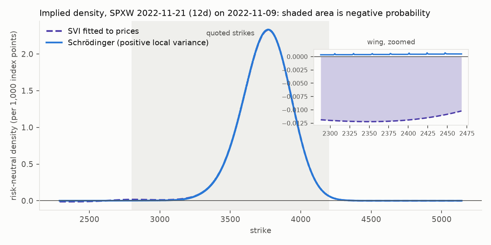
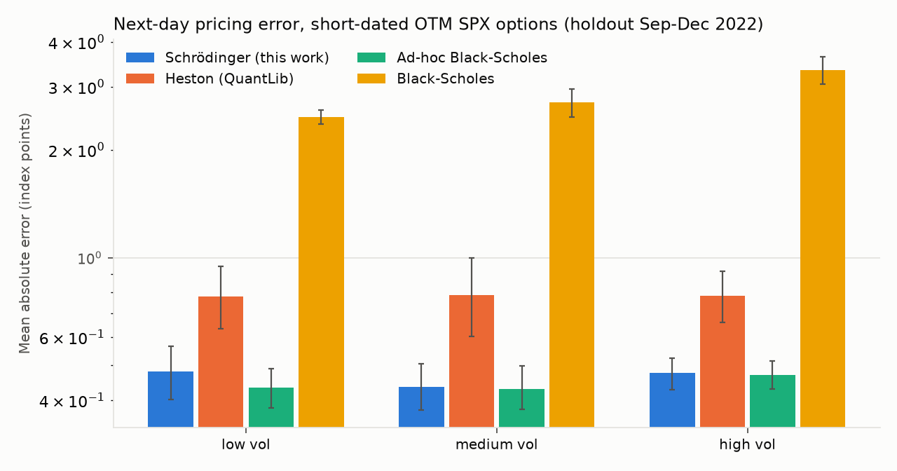
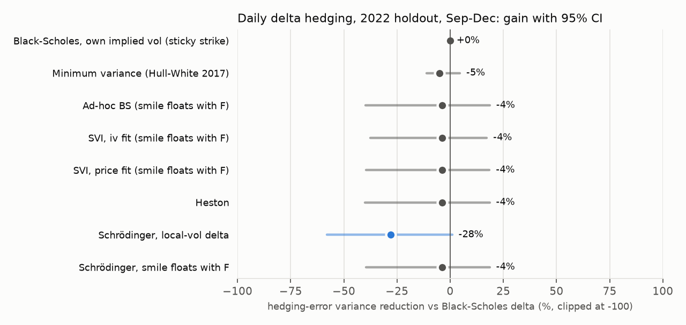
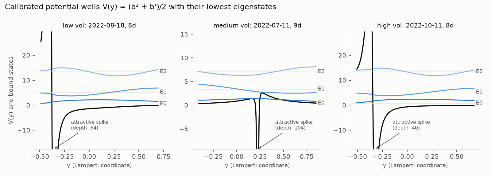
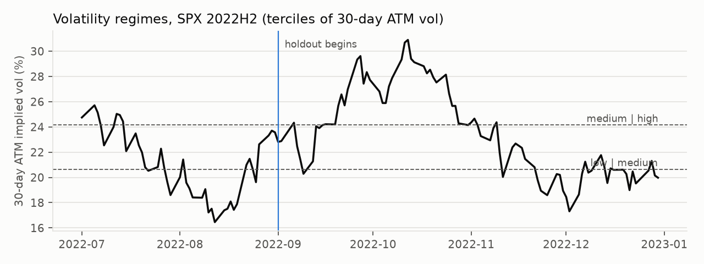

# schrodinger-local-vol

I price SPX options by solving a Schrödinger equation. A stochastic-volatility smile is squeezed
down to one dimension, turned into a particle in a potential well and evolved in imaginary time
with a C++ Crank-Nicolson solver. Then I test it on 1.2 million real SPX quotes from 2022 and a
second sample from August 2019, against the models people actually use.

[](https://github.com/issamarida/schrodinger-local-vol/actions/workflows/ci.yml)


## The honest result

On price it doesn't beat the practitioner smile. On the 2022 holdout it ties a quadratic smile
in implied vol (ad-hoc Black-Scholes) and SVI. In August 2019 it loses to ad-hoc Black-Scholes
by a wide margin on one of the two next-day tests.

What it does have is structure. It is a diffusion with positive local variance, so its density
can't go negative. Across 2,019 holdout slices it produced zero butterfly arbitrage. SVI fitted
to the same prices produced it on 36% of them once you extrapolate past the quoted strikes.

And because it's a diffusion, one well can carry the whole surface. On the 2022 holdout a
time-dependent well fits every expiry of a day within 3% of separate per-slice fits (in 2019 the
gap is bigger), with zero calendar arbitrage where per-slice fitting has it on a third of expiry
pairs. It also prices an expiry it never saw better than interpolating SVI or ad-hoc smiles.

Its delta is a local-vol delta, which turned out to be a bet on how the smile moves. It lost
that bet in late 2022 (28% more hedging error than Black-Scholes) and won it in August 2019 (60%
less, though 22 days leave a wide interval).

That's the project in four paragraphs. The rest is detail.

| question | 2022 holdout | August 2019 |
|---|---|---|
| Better next-day prices than the practitioner smile? | tie (0.467 vs 0.450) | no (0.973 vs 0.473) |
| Butterfly arbitrage, mine vs SVI fitted to prices | 0% vs 36% of slices | 0% vs 23% |
| One process for every expiry, error vs per-slice fits | +3%, zero calendar arbitrage | +59%, zero calendar arbitrage |
| Local-vol delta vs Black-Scholes delta | 28% worse | 60% better |



## Price

Short-dated (≤ 30 days) out-of-the-money SPX options. Mean absolute error against the bid-ask
mid, in index points, with 95% day-block bootstrap intervals. Full tables in
[`results/RESULTS.md`](results/RESULTS.md).

Holdout, Sep–Dec 2022 (220,719 quotes on the re-marked test):

| test | Schrödinger | Ad-hoc BS | SVI (price fit) | SVI (iv fit) | Heston | Black-Scholes |
|---|---:|---:|---:|---:|---:|---:|
| next day, ATM vol re-marked | 0.467 | **0.450** | 0.474 | 0.665 | 0.782 | 2.935 |
| next day, everything frozen | **1.845** | 1.866 | 1.849 | 1.849 | 1.929 | 3.360 |
| in-sample fit | **0.232** | 0.288 | 0.251 | 0.505 | 0.318 | 2.841 |

The re-marked test is the one that matters. Every model refits one level parameter to the two
next-day quotes nearest the forward, then predicts the rest of the smile. Against ad-hoc BS the
Schrödinger model is 3.8% worse [−9.2, +1.3]. Against SVI fitted on prices it's 1.4% better
[+0.6, +2.2]. Against Heston it's 40% better. Dumas, Fleming and Whaley found in 1998 that
deterministic-vol models struggle to beat the ad-hoc smile out of sample. Still true.

SVI here uses the same five-parameter formula as my local variance. The only difference is that
SVI applies it to implied variance. I fit it two ways. Fitting implied vols directly is what
desks do. In-sample it gets the implied-vol RMSE down to 0.45 vol points against 2.3 for the
Schrödinger model, but it buys that in the far wings: its median error (0.27 vol points) is
twice the Schrödinger model's (0.13), and on price it loses (0.665). Fitting prices, like every
other model here, gets it to 0.474.



## No arbitrage

A smile has butterfly arbitrage when call prices stop being convex in strike, which means a
negative probability density somewhere. I price every calibrated holdout slice on a 1-point
strike grid and look for negative butterflies. *Quoted* means between the lowest and highest
strike the model was fitted on. *Wings* means that range widened by half on each side.

| model | quoted | wings | calendar arbitrage |
|---|---:|---:|---:|
| Schrödinger | **0%** | **0%** | 33% of adjacent expiry pairs |
| Ad-hoc BS | 0% | 0% | 31% |
| SVI, fit to prices | 12.8% | 36.4% | 44% |
| SVI, fit to implied vols | 1.5% | 3.7% | 23% |
| Heston | 0.1% | 0.2% | 13% |
| Black-Scholes | 0% | 0% | 4% |

Is the zero real or did the solver hide something? The density is clipped at zero after each
solve as a safety net. I recompiled the solver without the clip and ran 400 random calibrated
holdout wells through it at both grid sizes: not one grid node went negative. The positivity
comes from the PDE and a scheme that respects it (implicit start-up steps damp the oscillations
Crank-Nicolson would otherwise leave), not from the clip.

Two things I didn't expect.

I expected the quadratic smile to break in the wings. It didn't, on any slice in either period.
For short-dated SPX the skew is never steep enough relative to the level to violate Durrleman's
condition inside this range. SVI is the one that breaks. Nothing in raw SVI keeps the density
positive unless you impose Gatheral and Jacquier's conditions, and I didn't, because desks
often don't. Heston's handful of flags are QuantLib integration noise (negative mass around 1e-5).

The other surprise is the last column. Fitted one expiry at a time, *every* smile model has
calendar arbitrage, mine included. Two slices fitted separately are two unrelated processes.
That's the case for fitting the whole surface with one process, which is the next section.

For context, the market itself: after paying the bid-ask spread there was an executable
butterfly on 1 of 2,019 holdout slices.

## One well for the whole surface

The solver prices every maturity from one forward solve, so the per-slice limitation was always
artificial. I tried three versions, each calibrated per day to every expiry from 2 to 45 days.

Holdout, Sep–Dec 2022. Per-slice fits get 0.261 in-sample on the same quotes, with 5 parameters
per expiry and calendar arbitrage on a third of pairs.

| model | parameters per day | in-sample MAE | calendar arbitrage | leave-one-expiry-out MAE |
|---|---:|---:|---:|---:|
| one well, time-homogeneous | 5 | 1.805 | 0 of 1,858 pairs | 1.874 |
| one well on a fitted clock | 29 | 0.448 | 0 | 0.847 |
| time-dependent well | 120 | **0.270** | **0** | **0.719** |
| SVI (price fit), interpolated in total variance | | | | 0.737 |
| ad-hoc BS, interpolated in total variance | | | | 0.768 |
| SVI (iv fit), interpolated in total variance | | | | 0.842 |

**One fixed well** is the purest test: five numbers for the whole surface. It gets the level
roughly right and the short-dated skew badly wrong. A time-homogeneous local vol can't produce a
skew that steepens as expiry shrinks, and SPX's does.

**A fixed well on a fitted clock** (σ(x, t) = λ(t)σ(x)) is the same potential read at a warped
imaginary time τ(T). The clock is a running sum of positive increments, so calendar arbitrage is
impossible for any parameters. It helps a lot but still can't change the smile's shape with
maturity. On the day I restarted it from four different points it landed on the same error each
time, so that's the model, not the optimiser.

**The time-dependent well** gives each interval between expiries its own five-parameter local
variance, fitted one expiry at a time with the earlier ones held fixed. It's still one positive
diffusion, so neither butterflies nor calendars can appear. In-sample it's 3% behind the
unconstrained per-slice fits. The test that matters is pricing an expiry the model was never
fitted to. The well just runs the diffusion through the gap. The practitioner approach
interpolates the neighbouring smiles linearly in total implied variance. The well beats every
interpolated smile. Against the best of them, price-fitted SVI, it's 2.5% [+1.8, +3.1] better.
In August 2019 that margin is 10%, though over 22 days it isn't significant. The 2019
in-sample fit is weaker than in 2022, 0.242 against 0.152 for per-slice fits, and the gap grows
with maturity: 0.110 vs 0.104 under a week, 0.313 vs 0.178 at 31-45 days. That's the signature
of a bootstrap, where each segment inherits the errors of the ones before it. 2019 had 18
expiries a day against 24 in 2022, so each segment had to cover more ground. A joint fit of all
segments should help, at a higher cost.

## Hedging

Every OTM option that is still quoted the next day gets hedged once with futures on its own
forward: error = ΔV − δ·ΔF. The score is Hull and White's gain, 1 − SSE(model) / SSE(Black-Scholes).
The minimum-variance delta of Hull and White (2017) is fitted on Jul–Aug 2022 and then frozen.

| delta | 2022 holdout | Aug 2019 |
|---|---:|---:|
| Black-Scholes at own implied vol (sticky strike) | 0% | 0% |
| Minimum variance (Hull–White) | −5% [−11, +5] | +12% [+9, +15] |
| Schrödinger, local-vol delta | −28% [−58, +1] | +60% [−50, +79] |
| Ad-hoc BS, SVI or Heston (smile moves with F)¹ | −4% [−40, +19] | −165% [−268, −143] |

¹ These four are within a few points of each other; ad-hoc BS shown.



The usual line is that local vol hedges badly because it implies sticky-strike dynamics. Half
right. It does hedge badly in 2022, but the mechanism is different. Local vol fixes the
variance as a function of the absolute index level, so when the index rises the implied vol at
a fixed strike *falls* by roughly the skew slope. Sticky strike keeps it flat. Parametric smiles
in log-moneyness move it the other way. So with a negative skew the local-vol delta is the
lowest of the three and the floating-smile delta is the highest.

Which one wins depends on what the smile actually does. The tables in `RESULTS.md` regress the
Black-Scholes hedging error on the index move to get the delta adjustment that would have been
optimal after the fact:

* Aug 2019, 25–50 delta puts: optimal −0.115, local vol −0.120. Almost exact.
* Sep–Dec 2022, same bucket: optimal +0.021, local vol −0.047. Wrong sign.

In 2019 vol spiked when the market fell, the textbook pattern, and local vol nailed it. In late
2022 implied vol reacted much less to the index than the skew implied. The minimum-variance
delta, fitted on two months of the same year, didn't help either. Two caveats. 22 days in 2019
is not much, hence the wide interval. In 2022 two CPI days (13 Sep and 10 Nov) carry half the
squared error. Dropping all four CPI releases makes local vol look worse, not better (−49%).

## The idea

Full derivation in [`docs/theory.md`](docs/theory.md).

1. **Project stochastic vol onto one dimension.** Gyöngy's theorem says a diffusion with local
   variance σ²(x) = E[v | X = x] has exactly the SV model's option prices. I parameterise σ²(x)
   with an SVI shape, five parameters.
2. **Lamperti transform.** y = ∫dx/σ(x) gives a unit diffusion dY = b(Y)dt + dW with
   b = −(σ + σ′)/2.
3. **Gauge transform.** q = e^{B}ψ turns Fokker-Planck into the imaginary-time Schrödinger equation
   ∂ψ/∂t = −Hψ with H = −½∂²/∂y² + V(y) and V = ½(b² + b′).
4. **The smile is the potential.** A flat smile is a flat well (V = σ²/8, exactly Black-Scholes).
   Linear SVI wings make V asymptotically harmonic, so the spectrum is discrete.



Calibrated SPX wells are mostly flat where the particle lives, with a steep wall on the put side
(the skew) and a sharp attractive spike where the local variance bottoms out. That spike is the
kink in the short-dated smile. The density at expiry, below each well, is close to Gaussian in
y: the Lamperti map has already absorbed most of the smile.

A caveat a physicist would raise: the spectrum is discrete only in principle. With ρ close to −1
the call side of the well is nearly flat, the level spacing is about 0.2 per year and
T·(E₁ − E₀) is around 0.005 at 8 days. An eigen-expansion would need hundreds of states, so
the PDE does the pricing. [`docs/theory.md`](docs/theory.md#4-why-the-smile-is-a-potential-well)
has the numbers.

## Engineering

C++20 core in `cpp/`, no runtime dependencies:

| component | what it does |
|---|---|
| `schrodinger.cpp` | Builds the potential (RK4 Lamperti inversion, closed-form gauge) and propagates ψ with Crank-Nicolson plus Rannacher start-up. H is factorised once per segment, so each step is one O(N) sweep. The time-dependent well carries the density across breakpoints in x onto each segment's own grid. |
| `pricer.cpp` | Density to prices with prefix sums, exact kink handling and an O(h²) martingale correction. One solve prices every strike and every maturity. |
| `spectral.cpp` | Bound states by Sturm bisection and inverse iteration, exact on the harmonic oscillator. `qp_price --states` computes them on a domain wide enough to be the well's own and says whether the expansion is usable at that maturity. |
| `black76.cpp` | Black-76 and a safeguarded Newton implied-vol solver. |
| `bindings/` | pybind11, GIL released while pricing. |

Validation: 22 C++ test cases and 19 Python tests. A flat well reproduces Black-76 to under 0.01
index points. Convergence is second order. A separate backward local-vol PDE solver that shares
no code with the Schrödinger solver agrees to 5 × 10⁻⁴ points. The time-dependent well reproduces
the homogeneous solve when every segment is the same, and gives Black-Scholes with integrated
variance when every segment is flat. A test throws deliberately ugly wells at it and checks there
is no butterfly or calendar arbitrage on a 1-point grid.

Speed (one core, 100 strikes): 0.76 ms per slice at 600 × 100, 2.4 ms at the 1200 × 200
evaluation grid. The 2022 backtest prices 1.2M quotes with six models, including 2,900 QuantLib
Heston calibrations, in about 15 minutes on 32 cores.

## Protocol

Every choice in the original pricing study was fixed on Jul–Aug 2022. Sep–Dec 2022 was run once,
afterwards.

* **Data:** every SPX and SPXW end-of-day quote, 127 trading days.
* **Filters:** out-of-the-money only, 2–45 days to expiry (≤ 30 for the headline), bid ≥ 0.05,
  spread ≤ 50% of mid.
* **Inputs:** forward from put-call parity, Treasury par curve, T = calendar days / 365 minus a
  day for AM-settled contracts.
* **Calibration:** least squares on prices in index points per expiry slice. SVI (iv fit) is the
  exception, on purpose.
* **Out of sample:** day-t parameters price day t+1. *Frozen* uses only t+1 observables.
  *Re-marked* first refits one level parameter to the two quotes nearest the forward and excludes
  them from scoring.

What came later, and you should know about it:

* The re-marked test was added after the development run.
* SVI, the arbitrage checks, the hedging test and the surface models were all designed after the
  2022 holdout had been seen. The August 2019 sample is the only data none of this was tuned on.
* SVI parameters are stored in implied-variance units, so freezing them overnight freezes the vol
  smile like every other model. Raw total-variance parameters would push every implied vol up as
  T shrinks and lose the frozen test for a bookkeeping reason.



## A second period: August 2019

22 trading days of SPX and SPXW from historicaloptiondata.com's free sample, run through the
exact same code with nothing changed. The 30-day ATM vol ran 14–22%, against 17–31% in the second
half of 2022. The free 0DTE-era sample on the same page (December 2023) has been taken down,
so there is no 2023+ test.

| test | Schrödinger | Ad-hoc BS | SVI (price fit) | SVI (iv fit) | Heston | Black-Scholes |
|---|---:|---:|---:|---:|---:|---:|
| next day, ATM vol re-marked | 0.973 | **0.473** | 1.025 | 1.257 | 0.630 | 3.830 |
| next day, everything frozen | **2.550** | 2.581 | 2.553 | 2.552 | 2.568 | 4.447 |
| in-sample fit | **0.139** | 0.284 | 0.228 | 0.457 | 0.204 | 3.768 |

The in-sample and frozen results carry over. The re-marked result doesn't: ad-hoc BS halves my
error. It comes down to the re-mark rule. Mine scales the whole local-vol curve by one factor, so
a jump in ATM vol also steepens the skew. Ad-hoc BS shifts the ATM vol and leaves slope and
curvature alone. Split the days by how much ATM vol moved overnight:

| overnight ATM vol move (median) | Schrödinger | Ad-hoc BS | Heston | SVI (price) |
|---|---:|---:|---:|---:|
| small (3%) | **0.325** | 0.375 | 0.335 | 0.390 |
| medium (11%) | 0.727 | 0.476 | **0.367** | 0.703 |
| large (21%) | 1.870 | **0.567** | 1.189 | 1.986 |

On quiet days it still wins. SVI uses the same multiplicative re-mark and fails the same way.
The obvious fix is an additive re-mark, but picking it now would be tuning on the test, so it's
listed under limitations instead.

No butterfly arbitrage from the Schrödinger model here either (0 of 394 slices). SVI broke on
33% (iv fit) and 23% (price fit) in the wings. Full tables in
[`results/2019-08/RESULTS.md`](results/2019-08/RESULTS.md).

## Quickstart

```bash
./scripts/fetch_data.sh          # free 2022 SPX sample from HistoricalData.net (~240 MB)
./scripts/fetch_data_2019.sh     # optional: August 2019 sample (~600 MB), see licence below
uv sync                          # builds the C++ extension; needs uv and a C++20 compiler

uv run qp-backtest               # pricing backtest, ~15 min on 32 cores
uv run qp-arbitrage              # butterfly and calendar checks
uv run qp-hedge                  # delta-hedging backtest
uv run qp-surface --start 2022-09-01   # whole-surface fits on the holdout, ~1 h on 32 cores
uv run qp-report                 # results/RESULTS.md and figures
# add --period 2019-08 to any of these for the second sample (drop --start); output goes to
# results/2019-08/

cmake -S . -B build && cmake --build build -j && ctest --test-dir build
```

```python
import qpricing as qp
well = qp.EffectiveVolParams(a=0.012, b=0.45, rho=-0.8, m=0.02, s=0.05)
qp.schrodinger_price(well, F=3577, T=9/365, df=0.999, strikes=[3300, 3700], is_call=[False, True])
sol = qp.solve(well, T=9/365)   # grid, Lamperti map, potential V(y), density at T
```

## Layout

```
cpp/include/qp, cpp/src   C++ core: potential, propagator (homogeneous and time-dependent),
                          pricer, spectrum, Black-76
cpp/tests                 doctest suite, incl. the independent backward-PDE cross-check
cpp/bindings              pybind11 module -> qpricing._qpcore
python/qpricing           data, models, backtest, arbitrage, hedging, surface, report
results/                  generated tables and figures (aggregates only)
docs/theory.md            the derivation
```

## Limitations

* **The re-mark rule.** Scaling the whole local-vol curve is the wrong way to absorb a big
  overnight vol move. Shifting the level additively would likely fix most of the 2019 gap. I
  haven't tested it because it was designed after seeing the result.
* **Kinked wells.** The curvature parameter `s` often sits at its lower bound on short-dated
  slices, which puts a narrow spike in V. Numerically harmless, possibly bad for prediction.
* **Two short samples.** Six months of 2022 and one month of 2019. Hedging results in particular
  swing with the regime, and 22 days is thin.
* **Bootstrapped surface.** The time-dependent well is fitted one segment at a time, so errors
  accumulate towards the long end. A joint fit is the next step.
* **The spectrum is decorative at these maturities.** The eigen-expansion is correct but needs
  hundreds of states for short-dated SPX wells. The PDE does all the pricing.
* **No costs.** End-of-day mids, no transaction costs, daily rebalancing only.

## Data and licence

2022: **[HistoricalData.net](https://historicaldata.net)** free options sample, Jul–Dec 2022.
Its licence allows research and publishing aggregate results, not redistributing quotes. The
repo has the download script and aggregate statistics, never the data.

2019: free August 2019 sample from historicaloptiondata.com (DeltaNeutral LLC). It doesn't come
with a licence of its own, and the site terms only grant personal, non-commercial use. The repo
has the download script and aggregate statistics computed from it, never the quotes.

Code: MIT, © 2026 Issam Arida.
