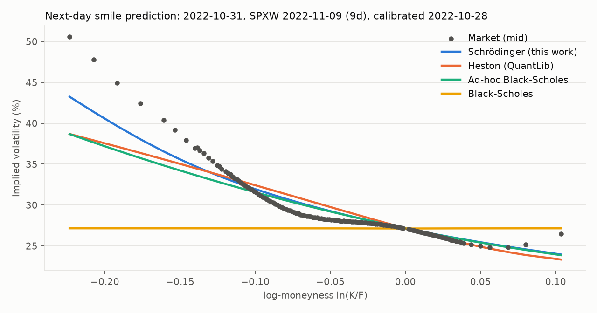

# quantum-pricing

**Option pricing as quantum mechanics in imaginary time.** A stochastic-volatility smile is
projected onto one dimension, transformed exactly into a Schrödinger equation with a
calibrated *potential well*, and solved with Crank–Nicolson finite differences in C++. It is
backtested on **1.2 million real SPX/SPXW option quotes** (Jul–Dec 2022) across three
volatility regimes against Black-Scholes, practitioner ad-hoc Black-Scholes and Heston
(QuantLib).

[](https://github.com/issamarida/quantum-pricing/actions/workflows/ci.yml)




## Results at a glance

Short-dated (≤ 30 days) out-of-the-money SPX options, **holdout period Sep–Dec 2022**. None of
these quotes were used to choose a single design decision (see [Protocol](#protocol)). The
figures are mean absolute pricing error vs. the bid-ask mid, in index points, with 95%
day-block bootstrap intervals. Full tables are in [`results/RESULTS.md`](results/RESULTS.md).

| Test | Schrödinger | Black-Scholes | Heston (QuantLib) | Ad-hoc BS (DFW) |
|---|---:|---:|---:|---:|
| **Next day, ATM vol re-marked** | **0.467** | 2.935 → **−84.1%** [−85.4, −82.7] | 0.782 → **−40.3%** [−46.9, −33.0] | 0.450 → +3.8% [−1.3, +9.2] |
| Next day, all parameters frozen | **1.845** | 3.360 → **−45.1%** | 1.929 → **−4.4%** [−6.5, −2.5] | 1.866 → **−1.2%** [−1.5, −0.8] |
| In-sample fit | **0.232** | 2.841 → **−91.8%** | 0.318 → **−27.2%** | 0.288 → **−19.6%** |

Read *"0.782 → −40.3%"* as: the Schrödinger model's error is 40.3% lower than Heston's 0.782.

**What this shows:**

* The quantum solver cuts **Black-Scholes' next-day error by 84%** and **Heston's by 40%**
  when the ATM vol is re-marked each morning. Both results hold in every volatility regime.
* It fits each day's smile best: 20–27% below the next-best model in-sample.
* Against the practitioner benchmark (Black-Scholes with a quadratic smile, Dumas–Fleming–Whaley
  1998) it is **statistically tied** out of sample. With frozen parameters it wins by a small
  but significant 1.2%. With the ATM re-marked it loses by 3.8%, inside the confidence
  interval. In the 2–7 day bucket the ad-hoc model is significantly better (−10.6%). DFW
  documented this result in 1998: deterministic-volatility models struggle to beat the ad-hoc
  smile out of sample. The test reproduces it on 2022 data.


## The idea in four lines

Full derivation: [`docs/theory.md`](docs/theory.md).

1. **Project the stochastic-volatility model onto 1D.** Gyöngy's theorem says a diffusion with
   local variance σ²(x) = E[v | X = x] has exactly the SV model's option prices. σ²(x) is
   parameterised with an SVI shape (5 parameters per expiry).
2. **Lamperti transform** y = ∫dx/σ(x) turns it into unit diffusion dY = b(Y)dt + dW, with
   b = −(σ + σ′)/2.
3. **Gauge transform** q = e^{B}ψ turns the Fokker–Planck equation into the imaginary-time
   Schrödinger equation **∂ψ/∂t = −Hψ**, where **H = −½∂²/∂y² + V(y)** and
   **V = ½(b² + b′)**. The option-price distribution is a wavefunction evolving in this
   potential.
4. **The smile is the potential.** A flat smile gives a flat well (V = σ²/8, exactly
   Black-Scholes). Linear SVI wings make V asymptotically *harmonic*, so the spectrum is
   discrete and the density has an eigen-expansion Σ e^{−Eₙt} φₙ(y) φₙ(0).


On real SPX data the calibrated wells have a steep wall on the put side (the skew) and a sharp
attractive spike at the minimum of the local variance. That spike is where the short-dated
smile has its kink.

## Engineering

**C++20 core** (`cpp/`, no runtime dependencies):

| Component | What it does |
|---|---|
| `schrodinger.cpp` | Builds the potential (RK4 Lamperti inversion, closed-form gauge), then propagates ψ with Crank–Nicolson plus Rannacher start-up. H is time-independent, so it is **factorised once** and each step is a single O(N) sweep. One forward solve prices every strike *and* every maturity ≤ T. |
| `pricer.cpp` | Density → prices with prefix sums (O(N + K log N)), exact kink handling and an O(h²) martingale correction. Calls integrate the upper tail and puts the lower tail, so far-OTM prices have no cancellation error. |
| `spectral.cpp` | Bound states of the well: Sturm-sequence bisection plus inverse iteration. |
| `black76.cpp` | Black-76 and a safeguarded Newton implied-vol solver. |
| `bindings/` | pybind11 module; releases the GIL while pricing. |

**Validation.** The suite has 19 C++ test cases (424 assertions) and 12 Python tests:

* **Black-Scholes limit:** a flat well reproduces Black-76 to < 0.01 index points (the SPX
  tick is 0.05).
* **Convergence:** second order. The error falls by 3.9–4.0× per grid halving.
* **Independent check:** a separate backward local-vol PDE solver shares no code with the
  quantum solver. The two agree to 5 × 10⁻⁴ index points.
* **Spectral checks:** the harmonic oscillator gives Eₙ = ω(n+½), and the eigen-expansion
  reproduces the PDE prices.
* **QuantLib cross-check:** Black-76 agrees with QuantLib to 1e-10.
* **Round-trips:** every model's calibration and the Heston pricing round-trip through
  QuantLib.

**Speed** (`./build/qp_bench`, one core, 100 strikes):

| grid (space × time) | per slice | slices / s |
|---|---:|---:|
| 300 × 50 | 0.28 ms | 3,600 |
| 600 × 100 | 0.76 ms | 1,300 |
| 1200 × 200 (evaluation grid) | 2.4 ms | 410 |

The full backtest prices 1.2M quotes with 4 models, including about 2,900 QuantLib Heston
calibrations, in 15 minutes on 32 cores.

## Protocol

Every choice below was fixed on the **development window (Jul–Aug 2022)**. The **holdout
(Sep–Dec 2022)** was run once, afterwards.

* **Data:** every SPX and SPXW end-of-day quote for 127 trading days.
* **Filters:**
  * out-of-the-money only;
  * 2–45 days to expiry (2–30 for the headline);
  * bid ≥ 0.05;
  * spread ≤ 50% of mid.
* **Market inputs:**
  * forward from put-call parity (median of the 5 strikes nearest the index);
  * Treasury par curve, interpolated to each expiry;
  * T = calendar days / 365, minus one day for AM-settled contracts.
* **Calibration:** each model is fitted per expiry slice by least squares on prices in index
  points. All models use the same quotes and the same objective.
* **Out-of-sample tests:**
  * *Frozen:* day-t parameters price day t+1 using only t+1 observables (forward, discount
    factor, T).
  * *ATM re-marked:* the same, but each model first refits **one** level parameter to the two
    t+1 quotes nearest the forward. Those two quotes are excluded from scoring.
  * Disclosure: the re-marked protocol was added after the development run. The frozen test
    turned out to be dominated by overnight moves in the overall vol level, which no frozen
    model can predict. Both tests are reported.
* **Regimes:** terciles of a VIX-like 30-day ATM implied vol computed from the same data:
  low < 20.6% ≤ medium < 24.1% ≤ high.


## Quickstart

```bash
# 1. Data: free SPX sample from HistoricalData.net (~240 MB, checksum-verified)
./scripts/fetch_data.sh

# 2. Python package (builds the C++ extension; requires uv and a C++20 compiler)
uv sync

# 3. Backtest and report
uv run qp-backtest            # about 15 min on 32 cores; writes data/processed/backtest.parquet
uv run qp-report              # writes results/RESULTS.md and the figures

# C++ only: library, CLI, tests
cmake -S . -B build && cmake --build build -j && ctest --test-dir build
./build/qp_price --forward 3577 --days 9 --rate 0.03 \
                 --strikes 3000,3300,3500,3577,3700,3850 --states 4
```

```python
import qpricing as qp
well = qp.EffectiveVolParams(a=0.012, b=0.45, rho=-0.8, m=0.02, s=0.05)
qp.schrodinger_price(well, F=3577, T=9/365, df=0.999, strikes=[3300, 3700], is_call=[False, True])
sol = qp.solve(well, T=9/365, n_states=3)   # grid, potential V(y), density, bound states
```

## Layout

```
cpp/include/qp, cpp/src   C++ core: potential, propagator, pricer, spectrum, Black-76
cpp/apps                  qp_price (CLI), qp_bench
cpp/tests                 doctest suite, incl. the independent backward-PDE cross-check
cpp/bindings              pybind11 module -> qpricing._qpcore
python/qpricing           data loading, models (BS / ad-hoc BS / Heston / Schrödinger),
                          regimes, backtest, report
results/                  generated tables and figures (aggregates only)
docs/theory.md            the derivation
```

## Limitations

* **One expiry at a time.** The effective variance is time-homogeneous inside a slice. A
  term-structure version would calibrate one well across all expiries; the solver already
  supports multi-maturity pricing from a single solve.
* **Kinked wells.** The SVI curvature parameter `s` often sits at its lower bound (0.001) on
  short-dated slices. The local variance then has a near-kink, and V has a narrow spike. It is
  numerically harmless (grid errors < 0.01 index points), but a smoother parameterisation or a
  penalty may predict better. It was not changed after seeing the holdout.
* **End-of-day mids, one period.** Six months of 2022 data, no transaction costs, and no
  hedging P&L test.

## Data and licence

Market data: **[HistoricalData.net](https://historicaldata.net)** free US options sample, Jul–Dec
2022. The data's licence permits research and publishing aggregate results, but not
redistributing quotes. The repository therefore contains only the download script and
aggregate statistics, never the data itself.

Code: MIT, © 2026 Issam Arida.
